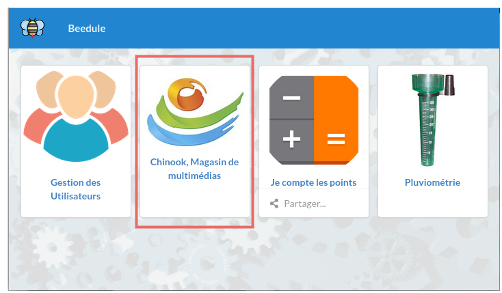
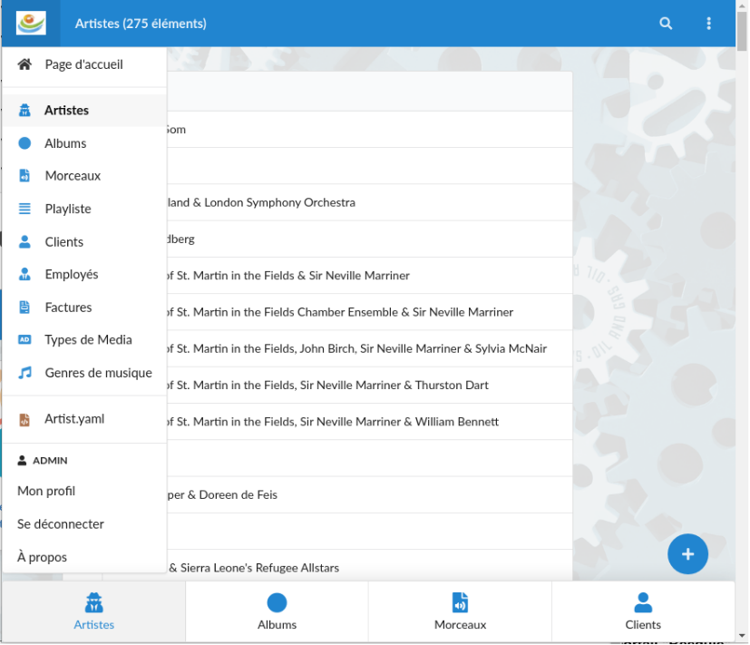

## application.yaml

```
# application CHINOOK
app-id: chinook
title: "Chinook, Magasin de multimédias"
image: "/bee/data/chinook/chinook.jpg"
group: chinook
menu: 
- table-id: Artist
  view-id: vall
  in-footer: true
- table-id: Album
  view-id: vall
  in-footer: true
- table-id: Track
  view-id: vall
  in-footer: true
- table-id: PlayList
  view-id: vall
- table-id: Customer
  view-id: vall
  in-footer: true
- table-id: Employee
  view-id: vall
- table-id: Invoice
  view-id: vall
- table-id: MediaType
  view-id: vall
- table-id: Genre
  view-id: vall
```
## L'application sur la page d'accueil du portail "Beedule"


### Les vues exposées de l'application



