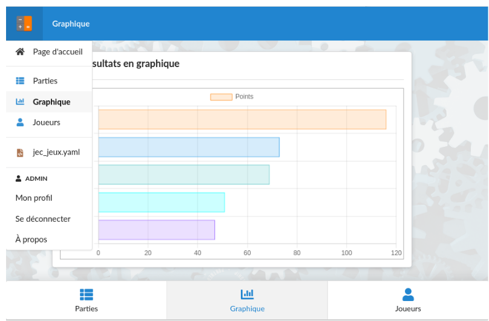

## Les applications

Un fichier `application.yaml` par application

`/voldev/data/beedule/jecompte/config/application.yaml`

```
# application JECOMPTE
app-id: jecompte
# Le titre de l'application dans le portail
title: "Je compte pour toi"
# seuls les utilisateurs du groupe auront accès à l'application
group: billerot
# logo de l'application (de type png ou svg)
# "/bee/data/<app-id>" : préfixe des fichiers de l'application
image: "/bee/data/jecompte/calc.png"
# Le lien de l'application pourra être partagé avec un anonyme
# il disposera des mêmes droits que l'émetteur
# par contre l'accès ne sera actif que durant la session
shareable: true
# Liste des vues exposées dans le menu de gauche et dans le pied de page
menu: 
- table-id: jec_jeux
  view-id: vjeux
  in-footer: true
- table-id: jec_jeux
  view-id: vgraph
  in-footer: true
- table-id: jec_joueurs
  view-id: vjoueurs
  in-footer: true  
```


Note: 
À noter que les vues avec l'option `in-footer` sont accessibles via des onglets en bas de page.
