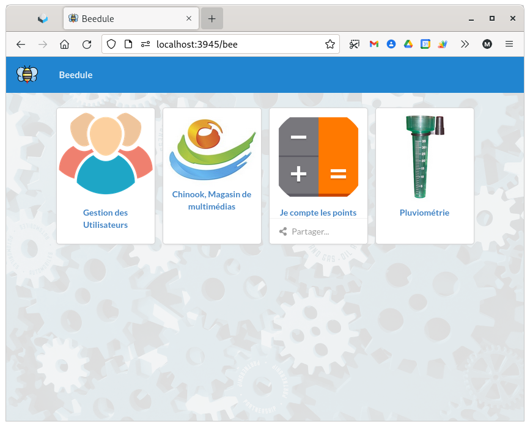

## Le portail

## Le fichier portail.yaml

`/volshare/data/beedule/portail.yaml`

```
# le titre du site
title: "Beedule"
info: "Framework de développement WEB en Yaml"
# image de type png ou svg
# qui apparaîtra dans l'onglet du navigateur et dans le menu du portail 
# "/bee/static/img" : préfixe des fichiers internes à la webapp beedule
icon-file: "/bee/static/img/beedule.png"

# Liste des applications accessibles du portail
# liste des répertoires ou l'on trouvera les fichiers application.yaml et <nom_table>.yaml
dico-dir:
- "./beedic/admin/config"
- "./beedic/chinook/config"
- "/volshare/data/beedule/jecompte/config"
- "/volshare/data/beedule/pluvio/config"
```
## La page portail


