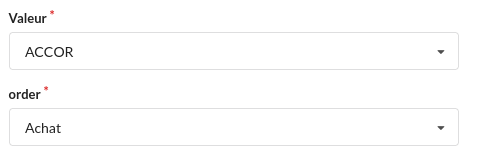

## Types de rubrique

## amount
> Gère les montants en €

```
elements:
  orders_quote:
    type: amount
    label-long: "Cours du jour"
    label-short: "Cours J"
    protected: true
  orders_buy:
    type: amount
    label-long: "Cours d'achat"
    label-short: "Achat à"
    required: true
```

## button
> Affiche un bouton dans le formulaire  
> L'activation va ouvrir l'`url` fournit en paramètre

```
elements:
  _action_sell:
    type: "button"
    Group: "trader"
    label-long: "Vendre cette valeur..."
    params:
      # bee/edit/<app>/<table>/<view>/<form>/<key.val>?args1=val1...
      # bee/add/<app>/<table>/<view>/<form>?args1=val1...
      url: "/bee/edit/picsou/orders/vachat/feditsell/{orders_id}?orders_order=sell&orders_sell={orders_quote}"
```

## card
> Regroupement de rubriques d'un dossier sous la forme d'une carte


```
elements:
  _card_MDP:
    type: card
    label-long: "Sécurité"
    icon-name: lock
    params:
      # cas formulaire de visualisation appélé sur le clic de la carte
      form: fmdp

    params:
      # cas formulaire de visualisation, vue ouverte dans la carte
      table: Track
      view: valbum
      where: "Track.AlbumId = '{AlbumId}'"

    params:
      # la carte sera sans bordure
      without-frame: true
      table: journal
      view: vcard
      where: "journal.compte = '{id}' and (journal.rapproche < 2 or journal.rapproche is null)" 
      
  _factures:
    type: card
      order: 300
      label-long: "Factures"
      icon-name: "file invoice"
      args:
        # la valeur du champ sera transmise au formulaire d'ajout de la vue
        CustomerId: "{CustomerId}"
      params:
        table: Invoice
        view: vclient
        where: "CustomerId = '{CustomerId}'"
      
```
Une `card` dans un formulaire d'édition sera utilisée pour placer des champs sur la même ligne
```
  fedit:
    title: "Morceau"
    groupe: chinook
    elements:
      TrackId:
        order: 10
        hide: true
      AlbumId:
        order: 20
        protected: true
      _group_title:
        type: card
        order: 100
      Name:
        order: 110
      Composer:
        order: 120
      _group_media:
        type: card
        order: 200
      MediaTypeId:
        order: 210
      GenreId:
        order: 220
      _group_data:
        type: card
        order: 300
      Milliseconds:
        order: 310
      Bytes:
        order: 320
      _group_last:
        type: card
        order: 400
      UnitPrice:
        order: 410
```


## chart
> graphique qui sera défini dans un `dataset`


```
elements:
  _graph:
    order: 20
    type: chart
    width: xl
    dataset:
      chartid: "select 'chart-pluvio'"
      mm2021: "select cumul_mois from (select distinct pluvio.mois, cumul_mois from pluvio where annee = '2021')"
      mm2022: "select cumul_mois from (select distinct pluvio.mois, cumul_mois from pluvio where annee = '2022')"
```
En savoir plus sur les [graphiques](/dictionnaire/chart/) 

## checkbox
> Case à cocher


```
elements:
  user_is_admin:
    type: checkbox
    label-long: "Administrateur"
    label-short: "Administrateur"
    col-align: center
```    
## counter
> Pour préciser que la rubrique (`repas_id` dans l'exemple) est un entier calculé par la base de données  
> `read-only` par défaut

```sql
CREATE TABLE IF NOT EXISTS "repas" (
	"repas_id" INTEGER NOT NULL,
	"repas_date" TEXT,
    ...
	PRIMARY KEY("repas_id" AUTOINCREMENT)
);
```
## date
> date du calendrier


```
elements:
 date:
    type: date
    label-long: "Date"
    label-short: "Date"
    # default-sqlite: "select date('now', '-1 day')"
    default-sqlite: "select datetime('now', 'localtime')"
    order: 30
```    

## datetime 
> date + heure


```
elements:
  orders_time:
    type: datetime
    label-long: "Jour Heure d'achat"
    label-short: "JH d'achat"
    default-sqlite: "select datetime('now', 'localtime')"
    width: m
```

## email
> email


```
elements:
  user_email:
    type: email
    label-long: "Email"
    label-short: "Email"
    required: true
```

## float
> nombre avec virgule floattante


```
elements:
  orders_buy:
    type: float
    label-long: "Cours d'achat"
    label-short: "Achat à"
    required: true
 ```

## image
> affichage d'une image  
> clic sur l'image pour la voir en grand


```
views:
  vdashboard:
    type: dashboard
    title: "Tableau de bord"
    icon-name: dashboard
    elements:
      _card_image:
        order: 210
        type: card
        label-long: "section image" 
        icon-name: image
      _rub_image:
       type: image
       label-long: "Une image"
       label-short: "image"
       params: 
         src: "/bee/data/demo/demo.jpg" # chemin vers l'image
         url: "/bee/data/demo/demo.jpg" # l'url appelé via le clic sur l'image
         title: "Le title sur l'image"  # la légende sous l'image
       order: 220
```

## list
> choix d'un item dans une liste



```
elements:
  orders_ptf_id:
    type: list
    label-long: "Valeur"
    label-short: "Valeur"
    items-sql: "SELECT ptf_id as 'key', ptf_name as 'label' From ptf order by ptf_name"
  orders_order:
    type: list
    label-long: "order"
    label-short: "order"
    col-align: center
    required: true
    items:
      - key: "buy"
        label: "Achat"
      - key: "sell"
        label: "Vente"    
```

## number
> nombre entier

```
elements:
  points:
    type: number
    label-long: "Points de la partie"
    label-short: "Points"
    width: l
    order: 40
    class-sqlite: "select case when {points} < 0 then 'negative' else '' end"
```

## pdf
> affichage un pdf  
> clic sur le `title` pour l'ouvrir dans une autre fenêtre


```
elements:
  _rub_pdf:
    type: pdf
    label-long: "Un document PDF"
    label-short: "pdf"
    params: 
      src: "/bee/data/demo/pdf-exemple.pdf"
      url: "/bee/data/demo/pdf-exemple.pdf"
      title: "Cliquez pour ouvrir le pdf en grand"
views:
  vdashboard:
    type: dashboard
    title: "Tableau de bord"
    icon-name: dashboard
    elements:
      ...
      _card_pdf:
        order: 400
        type: card
        label-long: "carte PDF" 
        width: l
        icon-name: "file pdf"
      _rub_pdf:
        order: 410
```

## percent
> numérique flottant dans un format ##0.00 %
```
elements:
  orders_gainp:
    type: percent
    label-long: "Gain en %"
    label-short: "en %"
    col-with: 80
    protected: true
    class-sqlite: "select case when {orders_gainp} > 0 then 'green' when {orders_gainp} < 0 then 'red' end"
```

## tag
> liste à choix multiples


```
elements:
  user_groupes:
    type: tag
    label-long: "Groupes"
    label-short: "Groupes"
    col-align: center
    width: xl
    items-sql: "select group_id as key, group_id as label from groups order by group_id"
```

## text
> zone de texte

## textarea
> zone de texte multilignes

## time
> zone de saisie d'une heure minute

## radio
> choix d'un item via des boutons radio


```
elements:
  note:
    type: radio
    label-long: "Note"
    label-short: "Note"
    items:
      - key: "1"
        label: "1"
      - key: "2"
        label: "2"
      - key: "3"
        label: "3"
      - key: "4"
        label: "4"
      - key: "5"
        label: "5"
```

## url
> zone de saisie d'une URL
