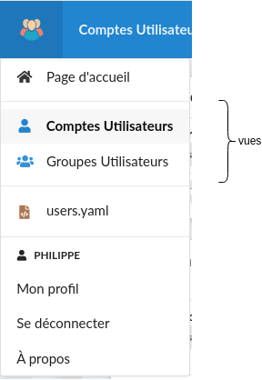

## Les vues

Les vues sont destinéee à être affichée dans le portail.  
La liste des vues de **toutes les tables** de l'application seront présentées dans le menu sous l'icône de l'application



```
views:
  vall:
    form-view: fview
    form-add: fadd
    form-edit: fedit
    group: admin
    deletable: true
    title: "Comptes Utilisateurs"
    icon-name: user
    order-by: user_name
    card:
      header:-
        - user_name
      meta:
        - user_email
      description:
      extra:
        - user_is_admin
      footer:
        - user_groupes
    elements:
      user_name:
      user_email:
        hide-on-mobile: true
      user_is_admin:
        hide-on-mobile: true
      user_groupes:
  
  vprofil:
    form-view: fprofil
    form-edit: fedit_owner
    group: owner
    title: "Mon profil"
    icon-name: user
    order-by: user_name
    card:
      header:
        - user_name
      meta:
        - user_email
      description:
      extra:
        - user_is_admin
        - user_groupes
    elements:
      user_name:
      user_email:
      user_is_admin:
      user_groupes:
```
## Les vues de type "card"

## Les vues de type "table"

