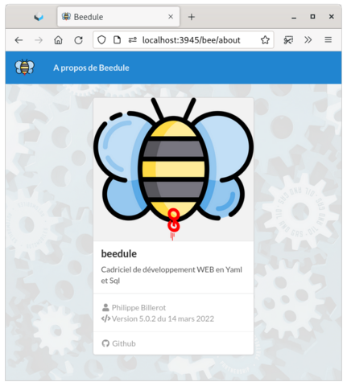

## Apprendre Beedule

**BEEDULE** est un **cadriciel** de développement et un **serveur** d'application WEB

Le même outil (le navigateur internet) pour développer et visualiser son application. 

C'est aussi un <a href="https://fr.wikipedia.org/wiki/CRUD" target="_blank">CRUD</a> pour réaliser les opérations de base sur des bases de données **Mysql**, **Sqlite** ou **Postgres**.

Le **développeur d'application** Beedule aura à décrire les vues, les formulaires et les traitements dans des fichiers textes au format <a href="https://fr.wikipedia.org/wiki/YAML" target="_blank">YAML</a> que nous appelerons le **dictionnaire**. Le language des scripts pour gérer les intéractions et les traitements seront écrits en <a href="https://fr.wikipedia.org/wiki/SQL" target="_blank">SQL</a>. 

L'objectif du guide est de vous présenter :

- l'interface et le style d'un site "beedulien"
- la structure du dictionnaire
- l'éditeur du dictionnaire
- l'installation de <a href="https://github.com/pbillerot/beedule" target="_blank">BEEDULE</a> sur un serveur <a href="https://fr.wikipedia.org/wiki/Debian" target="_blank">DEBIAN</a> dans un container <a href="https://fr.wikipedia.org/wiki/Docker_(logiciel)" target="_blank">DOCKER</a>

Cette documentation a été construite avec <a href="https://dynalon.github.io/mdwiki/#!index.md" target="_blank">mdWiki</a>
