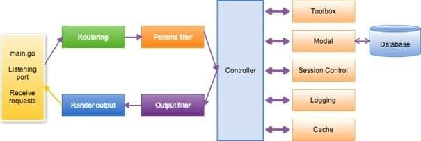

## Développement du framework Beedule

Beedule est développé avec le langage Go en utilisant le framework Beego.

<a href="https://github.com/pbillerot/beedule" target="_blank">Beedule sur Github</a>

**Beego** est un framework écrit en Go (diminutif de Golang). Il permet de coder des sites Internet (tout comme Django sur Python, Ruby On Rails sur Ruby, etc…). 

#### Architecture MVC de l'application

- `conf` : le fichier de configuration
- `controllers` : les contrôleurs
- `models` : les modèles
- `routers`: le fichier de routage
- `static` : pour les fichiers de type css, images et javascript dans leur dossier respectif
- `test` : les fichiers de test
- `views` : les vues



## Installation de golang

Exemple depuis Ubuntu 25.04

```sh
sudo apt install golang-go
```
### personnaliser ~/.profile
```bash
# Personnalisation
export PATH=$PATH:/usr/local/go/bin:/home/billerot/go/bin
export GOPATH=/home/billerot/go
```
```bash
source $HOME/.profile
go version
```
go version go1.24.2 linux/amd64

## Installation de beego et de l'outil bee
<a href="https://beego.wiki/docs/install/install/" target="_blank">Beego wiki</a>
<a href="https://beego.wiki/docs/install/bee/" target="_blank">Beego bee</a>

Pour installer

```bash
go install github.com/beego/beego/v2@latest
go install github.com/beego/bee/v2@latest
```
Pour mettre à jour

```bash
go get github.com/beego/beego/v2
go get github.com/beego/bee/v2
```


