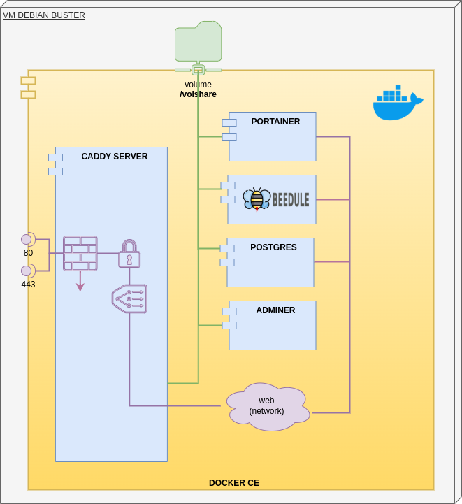

## Installation de docker

- https://docs.docker.com/engine/install/debian/
- https://docs.docker.com/engine/install/linux-postinstall/
- https://docs.docker.com/config/containers/logging/local/

```bash
sudo nano /etc/docker/daemon.json 
{
  "log-driver": "local",
  "log-opts": {
	"max-size": "10m"
  }
}
sudo apt install docker-compose
```
## La plateforme Docker



Notre plateforme sera composée des containers suivants :
- <a href="https://caddyserver.com/docs/" target="_blank">Caddy Server</a> le proxy pour contrôler le traffic et les accèss
- <a href="https://korben.info/portainer-io-un-outil-graphique-pour-gerer-vos-environnements-docker-en-toute-securite.html)" target="_blank">Portainer</a> pour gérer graphiquement l'environnement Docker
- **Beedule** le container de notre serveur web et cadriciel
- <a href="https://fr.wikipedia.org/wiki/PostgreSQ" target="_blank">Postgres</a> une base de données du monde libre

Les containers ont accès à la même ressource de fichiers `volshare` et les échanges entre **Caddy Server** et les autres containers se feront à travers le réseau privé `docker_web`. Ces containers ne sont pas  accessibles de l'extérieur.

À noter aussi que ces containers (hormis postgres et adminer) ont été développés en langage <a href="https://fr.wikipedia.org/wiki/Go_(langage)" target="_blank">Golang</a>.

## Réseau privé
Il faudra créer un réseau privé...

```bash
docker network create docker_web
```

## Volume partagé /volshare

`/volshare` est le répertoire partagé entre tous les containers.

```bash
sudo mkdir /volshare
sudo chown ${$user}:${$user} /volshare
```

Il pourra avoir la structure suivante :
```
/volshare
  /dev (le répertoire des données à sauvegarder)
    /store
      (le répertoire des fichiers statiques servi par Caddy)
  /persistent
    (les données persistantes : certificats, base de données... )
    /postgres
    /etc
  /docker (les fichiers de configuration des containers)
    /beedule
      custom.conf
      dockerfile
      docker-compose.yaml
    /caddy
      caddyfile.conf
      docker-compose.yaml
    /portainer
      docker-compose.yaml
    /postgres
      docker-compose.yaml
```
