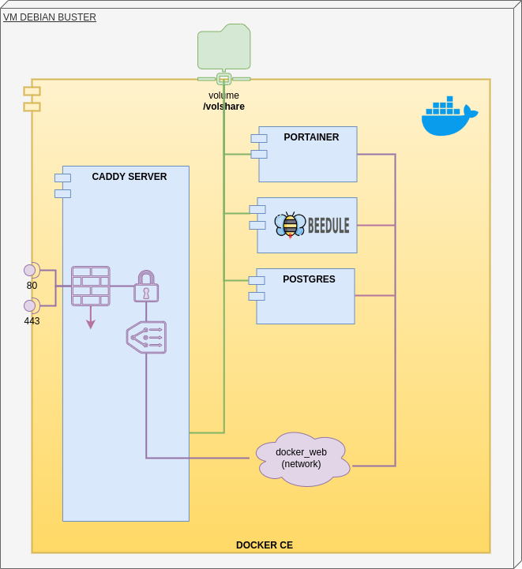

## Installation de docker

Les paquets `docker-ce` et `docker-compose` seront à installer (si cela n'a pas été déjà fait)

```bash
sudo apt update
# install prérequis
sudo apt install apt-transport-https ca-certificates curl gnupg lsb-release
# récup de la clé de l'archive
curl -fsSL https://download.docker.com/linux/debian/gpg | sudo gpg --dearmor -o /usr/share/keyrings/docker-archive-keyring.gpg
# ajout du paquet dans la source.list
echo "deb [arch=$(dpkg --print-architecture) signed-by=/usr/share/keyrings/docker-archive-keyring.gpg] https://download.docker.com/linux/debian  $(lsb_release -cs) stable" | sudo tee /etc/apt/sources.list.d/docker.list > /dev/null
sudo apt update
# install docker-ce
sudo apt install docker-ce docker-ce-cli containerd.io
# install docker-compose
sudo apt install docker-compose
# l'utilisateur pourra exécuter les commandes docker
sudo usermod -aG docker ${USER}
# service docker au démarrage du système
sudo systemctl enable docker
# puis reboot
```

## La plateforme Docker



Notre plateforme sera composée des containers suivants :
- [Caddy Server](https://caddyserver.com/docs/) le proxy pour contrôler le traffic et les accèss
- [Portainer](https://korben.info/portainer-io-un-outil-graphique-pour-gerer-vos-environnements-docker-en-toute-securite.html) pour gérer graphiquement l'environnement Docker
- **BEEDULE** le container de notre serveur web et cadriciel
- [Postgres](https://fr.wikipedia.org/wiki/PostgreSQL) une base de données du monde libre
- [Adminer](https://fr.wikipedia.org/wiki/Adminer) l'interface web pour gérer la base de données

Les containers ont accès à la même ressource de fichiers `volshare` et les échanges entre **Caddy Server** et les autres containers se feront à travers le réseau privé `web`. Ces containers ne sont pas  accessibles de l'extérieur.

À noter aussi que ces containers (hormis postgres et adminer) ont été développés en langage [Golang](https://fr.wikipedia.org/wiki/Go_(langage)).

## Réseau privé
Il faudra créer un réseau privé...

```bash
docker network create -d bridge web
```

## Volume partagé /volshare

`/volshare` est le répertoire partagé entre tous les containers.

```bash
sudo mkdir /volshare
sudo chown ${$user}:${$user} /volshare
```

Il pourra avoir la structure suivante :
```
/volshare
  /dev (le répertoire des données à sauvegarder)
    /store
      (le répertoire des fichiers statiques servi par Caddy)
  /persistent
    (les données persistantes : certificats, base de données... )
    /postgres
    /etc
  /docker (les fichiers de configuration des containers)
    /beedule
      custom.conf
      dockerfile
      docker-compose.yaml
    /caddy
      caddyfile.conf
      docker-compose.yaml
    /portainer
      docker-compose.yaml
    /postgres
      docker-compose.yaml
```
