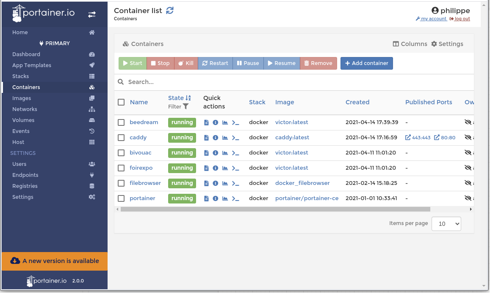

## Installation Portainer



[Portainer](https://korben.info/portainer-io-un-outil-graphique-pour-gerer-vos-environnements-docker-en-toute-securite.html) via son interface web permet de visualiser les ressources de la plateforme Docker, les containers, les images, les volumes, le réseau.

## dans Docker

`/volshare/docker/portainer/docker-compose.yaml`

```
#
# PORTAINER
#
version: "3.3"
services:
  portainer:
    image: portainer/portainer-ce:latest
    container_name: portainer
    command: -H unix:///var/run/docker.sock
    restart: always
    volumes:
      - /var/run/docker.sock:/var/run/docker.sock
    networks:
      - web
volumes:
  certs:

networks:
  web:
    driver: bridge
```

## dans Caddy

`/volshare/docker/caddy/caddyfile.yaml`

```
# portainer 
www.domain.com {
  ...
  rewrite /portainer /portainer/
  route /portainer/* {
    # on supprime le préfixe /portainer après le routage
    uri strip_prefix /portainer
    reverse_proxy portainer:9000
  }
}
...

ou si création d'une zone `portainer` dans le dns

portainer.domain.com {
  reverse_proxy portainer:9000
}
```
